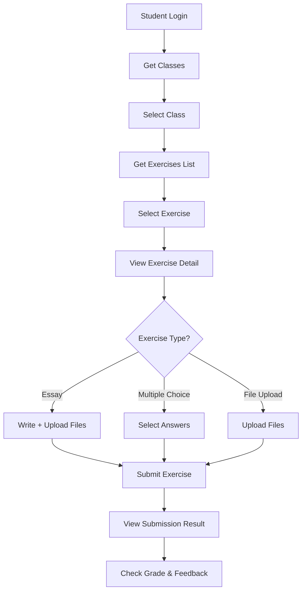

# ✅ TỔNG KẾT FLOW HỌC SINH - VÀO LỚP, CHỌN BÀI TẬP VÀ NỘP BÀI

## 🎯 FLOW HOÀN CHỈNH

### 1. **Học Sinh Đăng Nhập**

- Sử dụng token JWT để authenticate
- Middleware `authenticate` verify token
- Middleware `checkRole(['student'])` đảm bảo chỉ student truy cập

### 2. **Xem Danh Sách Lớp Học**

- Frontend gọi API lấy danh sách lớp học của student
- Student chỉ xem được lớp đã được approve

### 3. **Vào Lớp và Xem Danh Sách Bài Tập**

```
GET /api/exercises/class/:classId
```

- ✅ Authenticate student
- ✅ Kiểm tra student có trong lớp không
- ✅ Trả về danh sách bài tập với thông tin submission của student

### 4. **Chọn Bài Tập và Xem Chi Tiết**

```
GET /api/exercises/:classId/:exerciseId
```

- ✅ Xem đầy đủ thông tin bài tập
- ✅ Xem câu hỏi (nếu multiple choice)
- ✅ Download file đính kèm
- ✅ Kiểm tra deadline

### 5. **Nộp Bài Tập**

```
POST /api/exercises/:classId/:exerciseId/student_Submit
```

#### 🔹 **Loại Bài Tập Essay:**

```bash
# Content-Type: multipart/form-data
content: "Nội dung bài làm..."
files: [file1.pdf, file2.docx] # Optional
```

#### 🔹 **Loại Bài Tập Multiple Choice:**

```json
{
  "answers": [1, 0, 2, 1, 3] // Index đáp án cho từng câu
}
```

- ✅ Auto-calculate grade dựa trên correct answers
- ✅ Validation số lượng câu trả lời

#### 🔹 **Loại Bài Tập File Upload:**

```bash
# Content-Type: multipart/form-data
content: "Ghi chú bổ sung..." # Optional
files: [project.zip] # Required
```

### 6. **Xem Kết Quả Bài Làm**

```
GET /api/exercises/:exerciseId/my-submission
```

- ✅ Xem bài làm đã nộp
- ✅ Xem điểm số (nếu đã chấm)
- ✅ Xem feedback từ giáo viên

---

## 🛠️ TECHNICAL IMPLEMENTATION

### **Controllers Implemented:**

- ✅ `getExercisesByClass` - Danh sách bài tập trong lớp
- ✅ `getExerciseById` - Chi tiết bài tập
- ✅ `studentSubmitExercise` - Nộp bài tập
- ✅ `getMySubmission` - Xem bài làm của mình

### **Services Implemented:**

- ✅ `ExerciseService.getExercisesByClass()` - Lấy bài tập theo lớp
- ✅ `ExerciseService.getExerciseById()` - Chi tiết bài tập
- ✅ `ExerciseService.studentSubmitExercise()` - Xử lý nộp bài
- ✅ `ExerciseService.getMySubmission()` - Lấy bài làm của student

### **Routes Configured:**

```typescript
// Danh sách bài tập
GET /api/exercises/class/:classId

// Chi tiết bài tập
GET /api/exercises/:classId/:exerciseId

// Nộp bài tập (có hỗ trợ file upload)
POST /api/exercises/:classId/:exerciseId/student_Submit

// Xem bài làm của mình
GET /api/exercises/:exerciseId/my-submission
```

### **Validation & Security:**

- ✅ JWT Authentication required
- ✅ Role-based access control (only students)
- ✅ Class membership validation
- ✅ Deadline checking
- ✅ Prevent duplicate submissions
- ✅ File upload validation (type, size)
- ✅ Input validation với Yup schemas

---

## 🚦 BUSINESS RULES ENFORCED

### **Access Control:**

- ✅ Student chỉ xem được bài tập của lớp mình tham gia
- ✅ Student chỉ nộp được bài tập còn hạn
- ✅ Student không thể nộp lại bài đã nộp

### **Submission Rules:**

- ✅ **Essay**: Cần content hoặc file
- ✅ **Multiple Choice**: Cần trả lời đủ tất cả câu
- ✅ **File Upload**: Bắt buộc có file

### **Auto-Grading:**

- ✅ Multiple choice tự động tính điểm
- ✅ Essay và file upload chờ giáo viên chấm

### **File Handling:**

- ✅ Support multiple file upload
- ✅ Max 3 files per submission
- ✅ Max 50MB per file
- ✅ Allowed types: PDF, Word, Excel, PowerPoint, images

---

## 📱 FRONTEND INTEGRATION

### **Recommended Pages:**

1. **Exercise List Page** (`/class/:classId/exercises`)
2. **Exercise Detail Page** (`/class/:classId/exercises/:exerciseId`)
3. **Submit Exercise Page** (`/class/:classId/exercises/:exerciseId/submit`)
4. **Submission Result Page** (`/class/:classId/exercises/:exerciseId/result`)

### **Key Components:**

- ✅ Exercise list with status badges
- ✅ Multiple choice question form
- ✅ File upload component
- ✅ Rich text editor for essays
- ✅ Deadline countdown timer
- ✅ Submission status indicators

---

## 🔄 DATA FLOW



---

## 🧪 TESTING

### **Curl Examples:**

```bash
# Get exercises in class
curl -X GET "http://localhost:3000/api/exercises/class/6703d4b2e45c2d3f4e567890" \
  -H "Authorization: Bearer <token>"

# Submit multiple choice
curl -X POST "http://localhost:3000/api/exercises/classId/exerciseId/student_Submit" \
  -H "Authorization: Bearer <token>" \
  -H "Content-Type: application/json" \
  -d '{"answers": [1, 0, 2, 1, 3]}'

# Submit with file
curl -X POST "http://localhost:3000/api/exercises/classId/exerciseId/student_Submit" \
  -H "Authorization: Bearer <token>" \
  -F "content=Bài làm..." \
  -F "files=@submission.pdf"
```

---

## ✨ FEATURES HIGHLIGHTS

- 🔒 **Secure**: JWT auth + role-based access
- 📁 **File Support**: Multiple file upload với validation
- ⚡ **Auto-Grade**: Trắc nghiệm tự động chấm điểm
- 🕐 **Deadline Control**: Không cho nộp quá hạn
- 🚫 **Duplicate Prevention**: Không cho nộp lại
- 📊 **Progress Tracking**: Theo dõi trạng thái bài làm
- 💬 **Feedback System**: Nhận xét từ giáo viên

---

## 📚 DOCUMENTATION

- ✅ **API Documentation**: `docs/student-exercise-flow.md`
- ✅ **Code Examples**: `docs/student-api-examples.md`
- ✅ **React Components**: Example components provided
- ✅ **Error Handling**: Comprehensive error messages

---

**🎉 HOÀN THÀNH! Flow học sinh đã được implement đầy đủ với tất cả tính năng cần thiết.**
